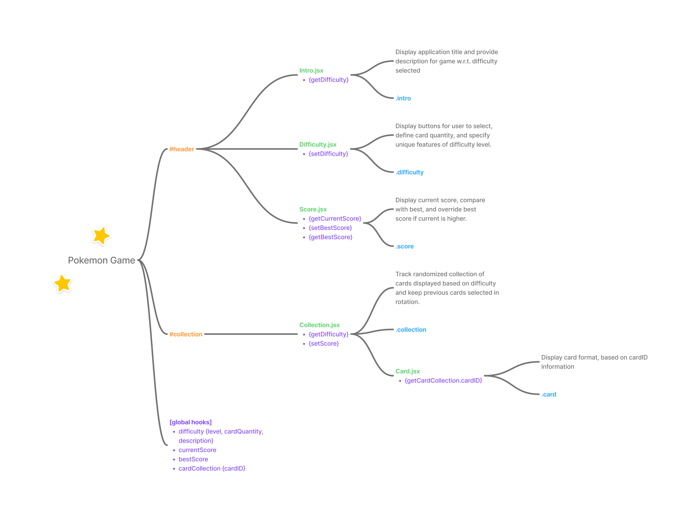
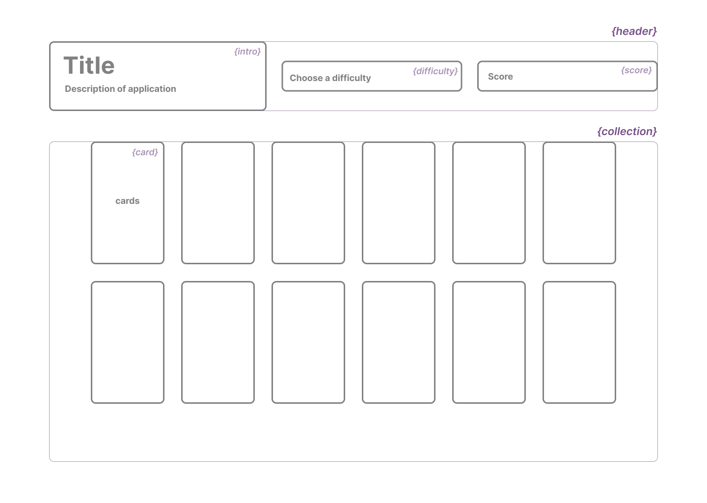

# The Odin Project - React Memory Card Project
This is my solution to the [Memory Card project on The Odin Project](https://www.theodinproject.com/lessons/node-path-react-new-memory-card). The Odin Project is a free open-source coding curriculum that provides a comprehensive study path for aspiring developers. 

## Table of contents

- [Overview](#overview)
  - [Screenshot](#screenshot)
  - [Links](#links)
- [My process](#my-process)
  - [Built with](#built-with)
  - [What I learned](#what-i-learned)
  - [Continued development](#continued-development)
  - [Useful resources](#useful-resources)
- [Author](#author)

## Overview

### The challenge

Create a memory game in React where users try to identify which cards they have not previously clicked. Some features of this application will be, 

- Display card images from external API. 
- Use hooks to manage states while fetching data from API. 
- Display current user score and best score from session. 
- Cards should be displayed in a random order once one is clicked. 

I decided to use [PokeAPI](https://pokeapi.co/) to create a Pokemon themed memory game.

### Screenshot

#### Final Screenshot

#### Flow Diagram 

#### Wireframe

This is a quick mockup used to draft the layout of the application and get an idea on what components I would need. 

### Links

## My process

### Built with

- Figma (wireframe)
- Vite, React, and Node.js
- [PokeAPI](https://pokeapi.co/)

### What I learned

- How to use an API! 🌈 Since there are 898 Pokemon available, I just have to display a random set of them on cards to the user using 
  
  `const pokemonInfo = await fetch(`https://pokeapi.co/api/v2/pokemon/${randomId}`);`

  Which will provide attributes such as the name, sprites urls, etc. 

- Composition! It is alright to use components inside other components, and is actually helpful to simplify functionality of each component overall. Using `<Card>` component inside the `<Collection>` components. 

### Nice to haves

- [] Type selection: play the game with only a specified type of Pokemon
- [] Include shiny versions of Pokemons in hard difficulty
- [X] Update description based on selected difficulty (ex. hard having more cards) 
- [] Cards styled like playing cards 
- [] Card wavering animation
- [] Retro sound feedback

### Useful resources

## Author

- Personal Website - [Colleen Nicole](https://www.colleennicole.com)
- Odin Website - [The Odin Project](https://www.theodinproject.com)
